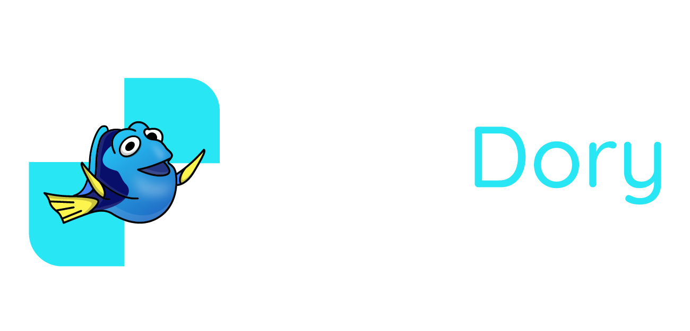

<h1 align="center">
    
</h1>

<h3 align="center">
    Strong Neural Network Chess Engine
</h3>

<p align="center">
<a href="https://www.runpod.io/">

</a>
</p>

### 🌐 Overview
- 🧠 **Powerful and Deep Analysis**
- 🚀 **High Performance**
- 📦 **Lightweight**
- 💻 **Cross Platform**
- 🔄 **UCI Compatible**
- 👌 **Free and Open Source**

StockDory, the mark of strength and efficiency, emerges as a proficient chess engine reengineered
in C++ from its popular and mighty C# predecessor, StockNemo.
Striving to ascend the peaks of excellence, StockDory serves as a testament to the spirit of 
continuous improvement, eliminating bugs and performance issues that blemished its otherwise
remarkable predecessor.

Download the latest release and try it out for yourself! 
For maximum performance, compile the engine specifically for your hardware using the
instructions below.

### 🛠️ Compiling
StockDory is written in C++ and uses CMake as its build system.

**Requirements**:
- 🏭 CMake >= 3.15
- 🐉 Clang (LLVM) >= 16.0.0
- 🥷 Ninja >= 1.10.2

**Steps**:
- 💾 Clone the repository
```bash
git clone https://github.com/TheBlackPlague/StockDory.git
```
- 🔦 Setup Build Process
```bash
cd StockDory
cmake -B Build -DCMAKE_BUILD_TYPE=Release -DCMAKE_C_COMPILER=clang -DCMAKE_CXX_COMPILER=clang++ -G Ninja
```
- 🪛 Compile
```bash
cmake --build Build --config Release
```
- 🏃‍♂️ Run
```bash
./Build/StockDory
```

### 🤝 Contributing
🖥 **Hardware Contributions:**

StockDory requires a lot of computational power to be tested and improved.
As such, the [FindingChess Testing Framework](http://tests.findingchess.com/)
was created.
This framework allows anyone to contribute to the development of StockDory
by donating their computational power.
It works by letting you run a Python script on your computer that will
automatically download and test StockDory on your hardware, relaying the
results back to the framework.

If you would like to contribute hardware for the development of StockDory,
please download the Client Worker from the
[FindingChess Testing Framework](http://tests.findingchess.com/) and run it.

📝 **Pull Requests and Bug Reports:**

StockDory is a community project, and as such, we welcome any and all contributors
looking to improve the codebase or report bugs.

If you would like to report a bug, please open an issue on this GitHub repository.

If you would like to contribute to the codebase, please fork this repository,
create a new branch (naming it appropriately for the changes you are making),
make your changes.
Then, create an account on the [FindingChess Testing Framework](http://tests.findingchess.com/).
Once your account is approved, appropriately set the source repository on your profile, and
create a test for your branch.

StockDory requires two tests to pass before a pull request can be merged: STC and LTC.

Once your STC test has passed, only then can you request a LTC test.
Given that the LTC test also passes, you may then open a pull request on this repository.

Please understand that at times your pull request may require some changes before it can be merged,
and that this is not a reflection of your work, but rather a reflection of the high standards
that StockDory is held to.

### 📑 Terms of Use
🚂 **StockDory Engine:**

The StockDory engine is licensed under the [LGPL-3.0](LICENSE). 
This is a very permissive license that allows you to use the engine
in almost any way you want.
This includes being able to send the engine to your friends, and
even being able to use the engine in your own projects.

The only requirement is that you must make the source code of your
project available to the public, and that StockDory's License is
included in your project.
This is to ensure that the engine, all the improvements made to it,
and all the works derived from it, remain free, open-source, and for
the benefit of the public.

StockNemo or StockDory would've never existed if it wasn't for the
generosity of the open-source community, and it's now our turn to
carry on that tradition.

🎀 **StockDory Logo:**
The StockDory Logo is licensed under the 
[CC BY-NC-ND 4.0 License](https://creativecommons.org/licenses/by-nc-nd/4.0/).

The Logo must be used in its entirety, and cannot be modified in any way.