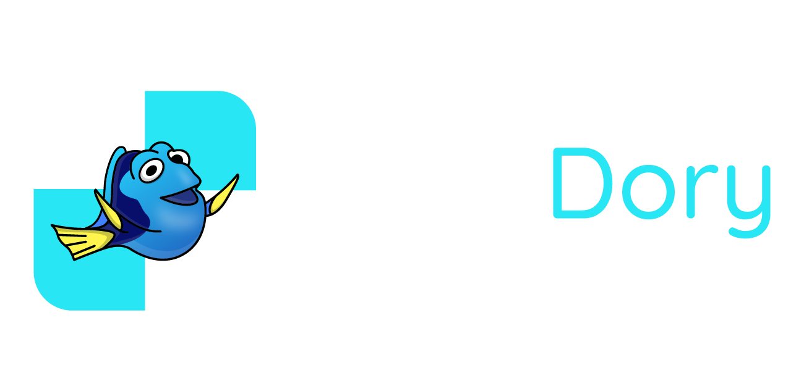

<h1 align="center">
    
</h1>

<h3 align="center">
    Strong Neural Network Chess Engine
</h3>

<p align="center">
<a href="https://www.runpod.io/">

</a>
</p>

### 🌐 Overview

- 🧠 Exceptional Tactical Analysis
- 🚀 Blazing Performance
- 📦 Lightweight and Scalable
- 💻 Cross Platform
- 🔄 UCI Compatible
- 👌 Free and Open Source

StockDory is a modern C++ chess engine combining neural-network evaluation with a deeply optimized tree search. Capable 
of analyzing millions of positions every second with remarkable accuracy, StockDory plays chess at a level far beyond 
human ability.

### 🎮 Building & Using

For the quickest way to get started, it is recommended to use one of the
[official release binaries](https://github.com/TheBlackPlague/StockDory/releases). These builds target the three major
desktop operating systems and common CPU architecture levels, making them suitable for most systems likely to run
StockDory.

> [!NOTE]
> StockDory is a command-line program that communicates through the **standard input and output streams** using the
> **Universal Chess Interface (UCI)** protocol. For normal use, it is recommended to pair StockDory with a
> **UCI-compatible** graphical interface such as [En Croissant](https://encroissant.org/).

For maximum performance, however, the best StockDory build is generally one compiled specifically for your native
hardware. The official releases cannot reasonably cover every processor or architecture combination, particularly for
new, uncommon, or recently introduced hardware. Compiling StockDory locally is therefore recommended when no suitable
release binary exists, when targeting a specialized platform, or when you simply want the best possible performance
from your system.

StockDory currently targets **C++23** and officially supports the **LLVM toolchain**. The recommended build environment
is:

* 👽 Git >= 2.30
* 🏗️ CMake >= 3.21 (recommended: 4.0.x)
* 🥷 Ninja >= 1.10 (recommended: 1.12)
* 🐉 LLVM >= 22 (recommended: 22.1.8)

> [!CAUTION]
> Other toolchains or build-system substitutions may work, but they are not officially supported and may produce builds
> with different behavior or performance characteristics. Maintaining equivalent support across multiple compiler
> toolchains is impractical due to differences in compiler behavior, optimization capabilities, and platform 
> integration.

**Compilation Steps:**
```shell
# Run these commands from a directory that does not already contain a
# directory named "StockDory"

# Clone the StockDory repository.
git clone https://github.com/TheBlackPlague/StockDory.git
cd StockDory

# Ensure the required toolchain is available through your system PATH
# before continuing...

# Choose one of the configurations below:

# OPTION A ---
# Native Build
#
# Recommended for local use. This build targets the capabilities of the
# current system and will generally provide the best performance on the
# machine on which it is compiled. 
# 
# The resulting binary may not be portable to systems with different CPU 
# capabilities.
cmake -B Build -G Ninja \
      -DCMAKE_BUILD_TYPE=Release \
      -DCMAKE_C_COMPILER=clang \
      -DCMAKE_CXX_COMPILER=clang++

# OPTION B ---
# Architecture-Targeted Build
#
# Recommended when building for redistribution. This disables native CPU
# targeting and instead generates a binary for the explicitly selected
# architecture or architecture level, such as x86-64-v3.
#
# Such a build is more portable across compatible systems, although it
# may not achieve the maximum possible performance on any one machine.
cmake -B Build -G Ninja \
      -DCMAKE_BUILD_TYPE=Release \
      -DCMAKE_C_COMPILER=clang \
      -DCMAKE_CXX_COMPILER=clang++ \
      -DBUILD_NATIVE=OFF \
      -DARCHITECTURE=<architecture>

# After running one of the above options, build StockDory using the 
# selected configuration
cmake --build Build

# The resulting executable will be available under:
# StockDory/Build

# It is recommended to test that it is working by running the bench command
cd Build
./StockDory bench
```

### 📑 Terms of Use

StockDory is licensed under [GNU AGPL v3.0](LICENSE).

The StockDory logo is licensed separately under the
[CC BY-NC-ND 4.0](https://creativecommons.org/licenses/by-nc-nd/4.0/) license.
